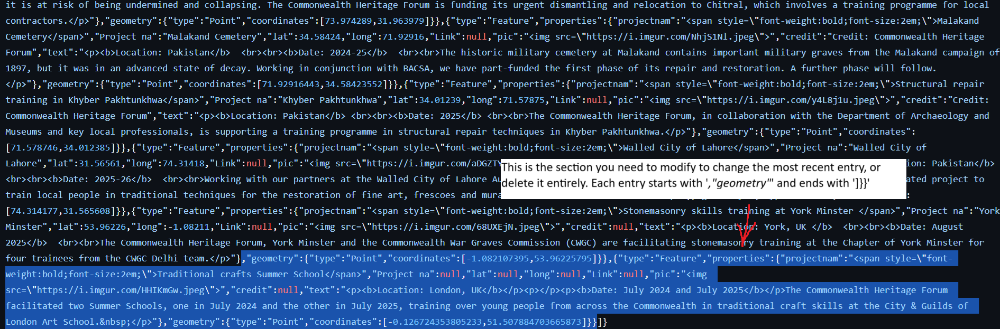

# Deleting or modifying recent additions to the map

# Don't worry about this unless making from scratch
Apply these settings to the end of the qgis2web .css file if creating from scratch in QGIS2Web

/* === Popup image fit tweaks === */
.leaflet-popup-content {
  overflow: auto; /* allow scrolling if needed without clipping */
}

.leaflet-popup-content img,
.leaflet-popup-content td img {
  max-width: 100% !important;  /* never exceed popup content width */
  height: auto !important;     /* preserve aspect ratio */
  max-height: 65vh;            /* prevent super-tall images from overflowing the viewport */
  object-fit: contain;         /* fit neatly if constrained */
  display: block;
  margin: 0.25rem auto;        /* tiny breathing room */
}
/* === End popup image tweaks === */

/* === Popup width normalization (added to prevent "skinny" popups) === */
.leaflet-popup-content {
  min-width: 300px;           /* ensure a reasonable baseline width */
  max-width: 70vw;            /* keep previous viewport cap */
}

.leaflet-popup-content table {
  width: 100%;                /* let table fill the popup width */
  table-layout: auto;
}
/* === End width normalization === */

/* === Popup width comfort (added by assistant on 2025-08-30) === */
@media (min-width: 640px) {
  .leaflet-popup-content-wrapper {
    max-width: 520px; /* gives room beyond Leaflet's 300px default */
  }
}
